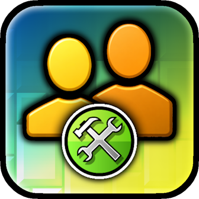

#  Level Collaborators
List other creators in your collabs!

>   

>  
>  
> 

> [!TIP]
> *This mod has settings you can utilize to customize your experience.*

---

## About
This mod allows level creators to invite other players as collaborators on their levels to ensure everyone gets credited!

---

### Joining
In the main menu, you can find the collaborations button in the menu located at the bottom and press it to open the collaboration manager. You can see all of your invites and active collaboration. You may accept or decline any invites you have pending review.

### Inviting
**As a level creator**, you can invite other players as collaborators by going to the info page of your published level and press the collaborators button on the left-hand side to open the collaboration manager page. Once open, you can type in the username of the player(s) you would like to invite.

---

### Credits
- **[ArcticWoof](https://www.github.com/DumbCaveSpider/)**: mod idea...

---

---

### Changelog
###### What's new?!
**[📜 View the latest updates and patches](./changelog.md)**

### Issues
###### What's wrong?!
**[⚠️ Report a problem with the mod](../../issues/)**

### Development
###### Work with the mod directly.
**[⌨️ Check the API out](./include/)**